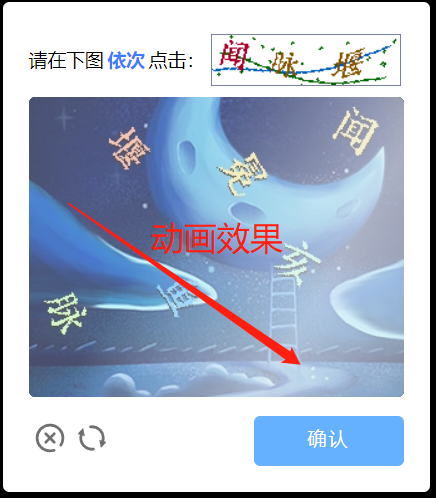
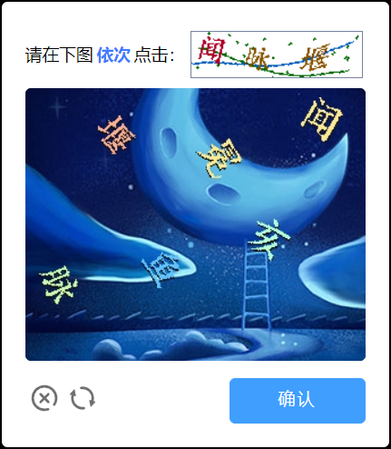
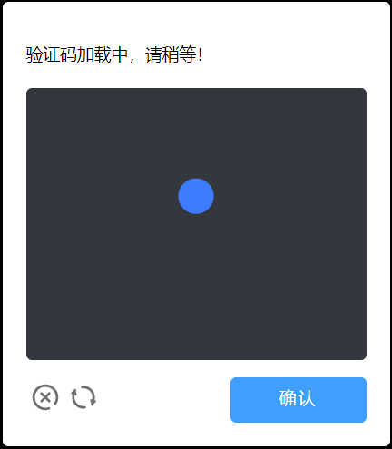

# go-captcha-vue3

注意：本项目仅包含主要的点选交互组件，不含有“打开按钮”等其他组件。

本项目将仓库：https://github.com/wenlng/go-captcha-vue 中的项目用vue3进行了改写，并添加了：

1. 组件任意宽度也能返回相对于原尺寸的答案
2. 提交时的动画
3. 响应式布局支持
4. 反馈消息



项目优化掉了width和height属性，前端根据服务器传回的图片进行自适应，并保存长宽，最后进行等比例计算，返回正确的，相对原图的点坐标结果
## 运行本示例项目

```sh
npm install
```

### 启动测试服务器

```sh
npm run dev
```
 ## 正式使用
### 引入组件
您可以直接复制GoCaptcha.vue文件到您项目的component文件夹中，然后按照下图方式在模版中引入并使用
### 使用组件
```html
<div class="captcha-box-wrap">
    <go-captcha
            :max-dot="maxDots"
            :image-base64="imageBase64"
            :thumb-base64="thumbBase64"
            @close="handleCloseEvent"
            @confirm="handleConfirmEvent"
            @refresh="handleRefreshEvent"
    />
</div>

```
go-captcha组件会撑满captcha-box-wrap的宽度，请您自行处理外部包裹组件的css，以达到想要的效果。期间您无需关心放大倍数问题，组件中已实现相关计算逻辑。

上述参数中：
* max-dot 为验证码中：最大验证点个数
* image-base64：验证的主图
* thumb-base64：验证码提示图
* @close 点击关闭按钮的回调
* @confirm 点击确定按钮的回调
* @refresh 点击刷新按钮的回调

其中handleConfirmEvent函数的参数定义应为：
```javascript
function handleConfirmEvent(data, ok, fail){

}
```
data：为答案结果

ok：显示成功消息的函数

fail：显示成功消息的函数
```javascript
ok("成功消息")

fail("失败消息")
```

更多属性请查看组件内的defineProps函数
用例可参考本示例项目中的App.vue
